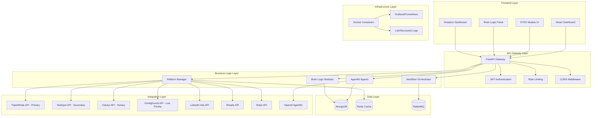
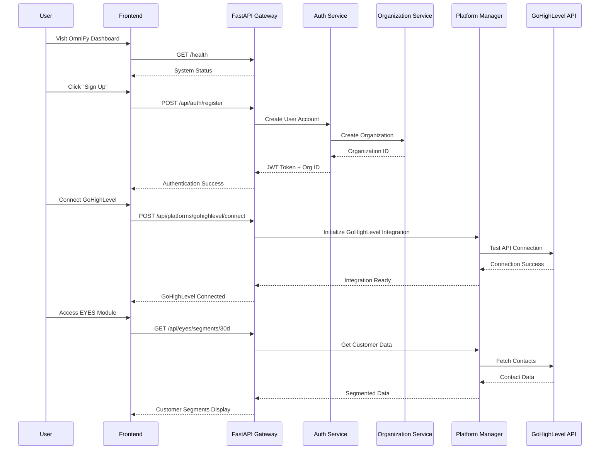
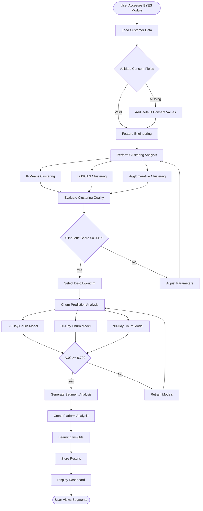
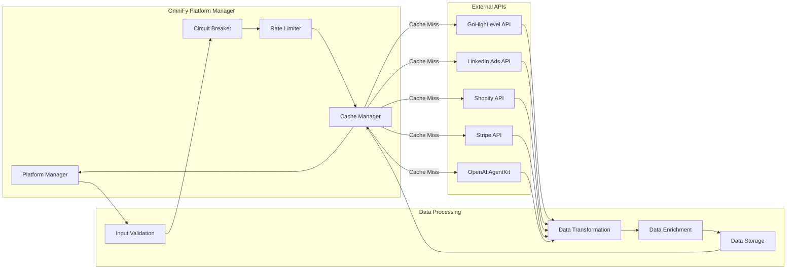
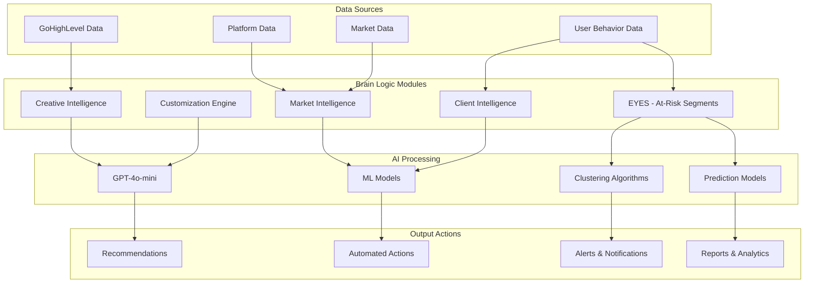
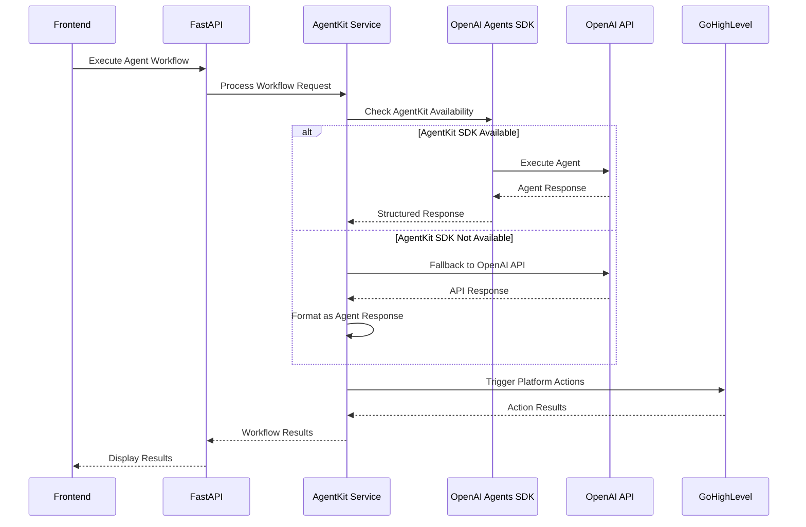
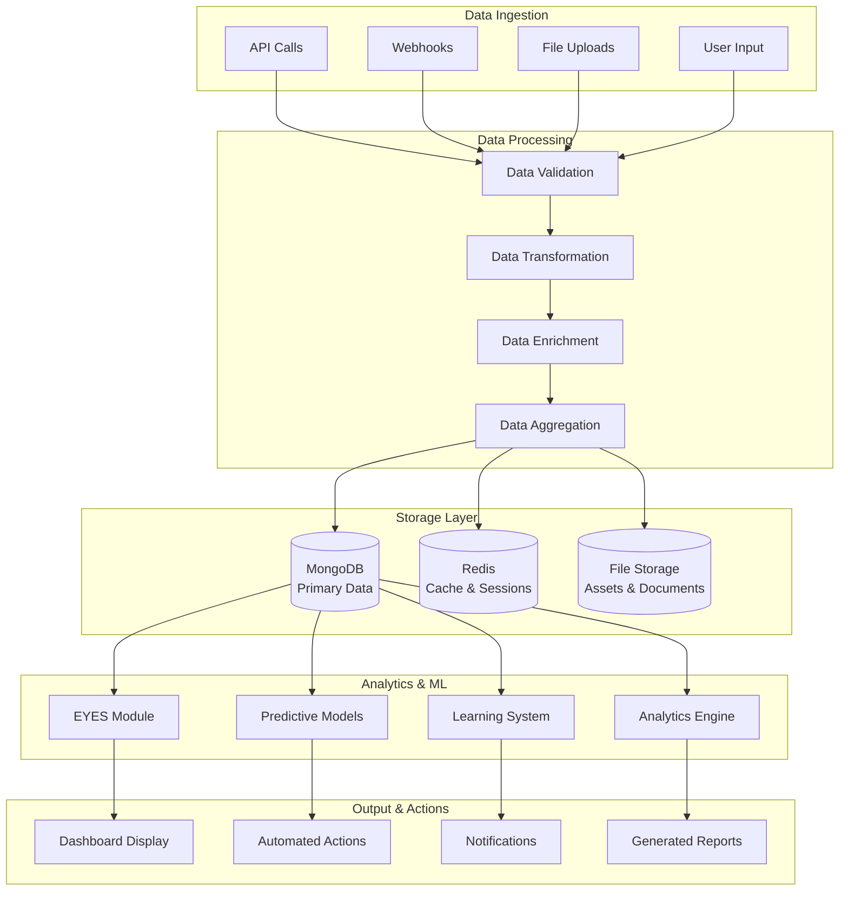
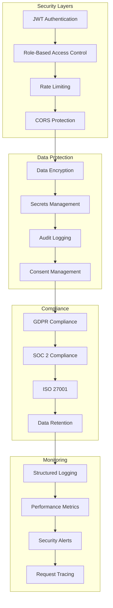
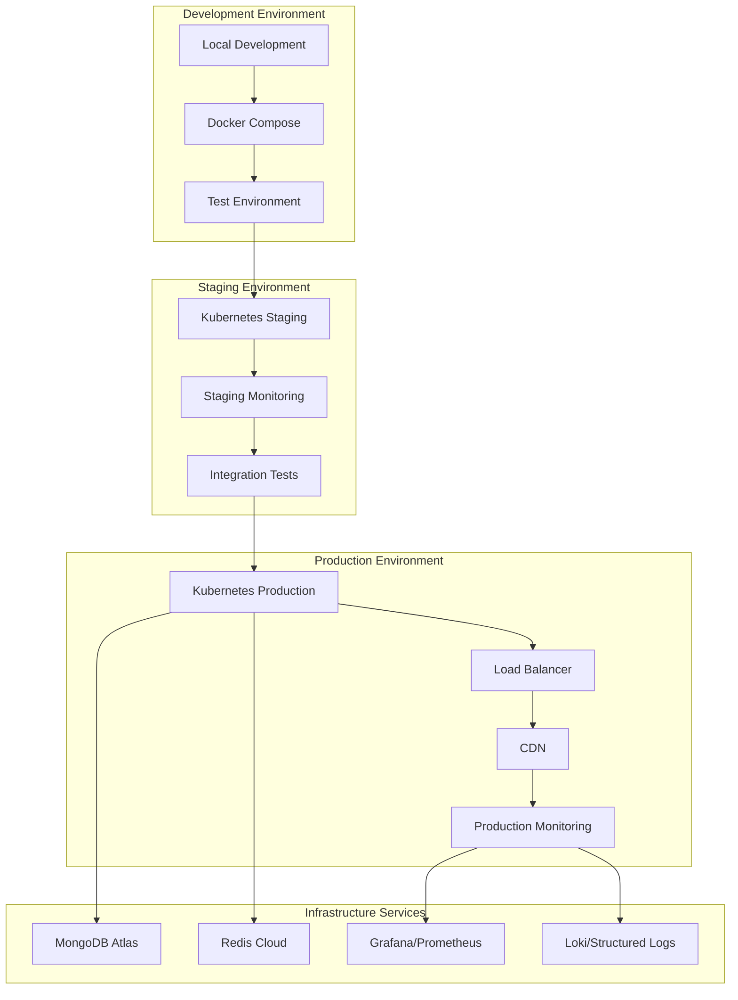

# 🏗️ OmniFy Cloud Connect - Architecture & User Flow Diagrams

## 📋 System Architecture Overview

### **High-Level Architecture**

---

## 🔄 User Flow Diagrams

### **1. Client Onboarding Flow**

### **2. EYES Module - Customer Segmentation Flow**

### **3. Platform Integration Flow**

### **4. Brain Logic Modules Architecture**

### **5. AgentKit Integration Flow**

### **6. Data Flow Architecture**

### **7. Security & Compliance Architecture**

### **8. Deployment Architecture**

---

## 🎯 Key Architecture Principles

### **1. Microservices Architecture**
- **Modular Design**: Each brain module is independent
- **API-First**: All modules communicate via REST APIs
- **Scalable**: Individual modules can be scaled independently

### **2. AgentKit-First Approach**
- **Visual Development**: Drag-and-drop agent creation
- **Enterprise Compliance**: Built-in SOC 2 & ISO 27001
- **Cost Efficiency**: 70-80% cost reduction vs custom development

### **3. Multi-Tenant Architecture**
- **Organization Isolation**: Complete data separation
- **Role-Based Access**: Granular permission system
- **Resource Sharing**: Efficient resource utilization

### **4. Event-Driven Architecture**
- **Asynchronous Processing**: Non-blocking operations
- **Real-Time Updates**: Live data synchronization
- **Workflow Orchestration**: Complex automation workflows

### **5. Security-First Design**
- **Zero Trust**: All requests authenticated and authorized
- **Data Encryption**: End-to-end encryption
- **Audit Trail**: Complete activity logging

---

## 🚀 User Journey Summary

### **Phase 1: Onboarding (10 minutes)**
1. **User Registration** → Organization Setup
2. **Platform Integration** → Connect GoHighLevel
3. **Feature Access** → EYES Module Activation
4. **Automated Setup** → Complete Onboarding Workflow

### **Phase 2: Daily Operations**
1. **Dashboard Access** → View Analytics
2. **Brain Logic** → AI-Powered Insights
3. **EYES Module** → Customer Segmentation
4. **Platform Actions** → Automated Workflows

### **Phase 3: Advanced Features**
1. **Predictive Intelligence** → ORACLE Module
2. **Content Repurposing** → VOICE Module
3. **Budget Optimization** → CURIOSITY Module
4. **Performance Analytics** → MEMORY Module

This architecture provides a scalable, secure, and efficient platform for autonomous marketing intelligence with the revolutionary AgentKit-first approach.
